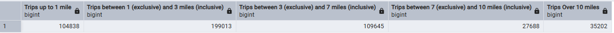
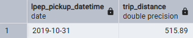
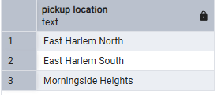
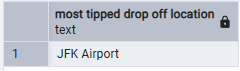

# Module 1 Homework: Docker & SQL
## Quesiton 1. Understanding docker first run
for `python:3.12.8` image using `bash` as an enterypoint to get `pip` version:

solution 1: running this docker command
`docker run -it --entrypoint bash  python:3.12.8 -c "pip --version"`

solution 2: In a `Dockerfile` :
```python
FROM python:3.12.8

# Set bash as the entrypoint
ENTRYPOINT ["bash"]

# Run pip --version when the container starts
CMD ["-c", "pip --version"]
```
then we build it using `docker build -t python-pip-version .`
and run it using `docker run -it python-pip-version`

In both cases teminal output: pip **24.3.1**. from /usr/local/lib/python3.12/site-packages/pip (python 3.12)`

---
### Question 2. Understanding Docker networking and docker-compose

Given the following docker-compose.yaml
```python
services:
  db:
    container_name: postgres
    image: postgres:17-alpine
    environment:
      POSTGRES_USER: 'postgres'
      POSTGRES_PASSWORD: 'postgres'
      POSTGRES_DB: 'ny_taxi'
    ports:
      - '5433:5432'
    volumes:
      - vol-pgdata:/var/lib/postgresql/data

  pgadmin:
    container_name: pgadmin
    image: dpage/pgadmin4:latest
    environment:
      PGADMIN_DEFAULT_EMAIL: "pgadmin@pgadmin.com"
      PGADMIN_DEFAULT_PASSWORD: "pgadmin"
    ports:
      - "8080:80"
    volumes:
      - vol-pgadmin_data:/var/lib/pgadmin  

volumes:
  vol-pgdata:
    name: vol-pgdata
  vol-pgadmin_data:
    name: vol-pgadmin_data
```
The hostname and port that pgadmin should use to connect to the postgres database are

> **hostname : db** <br>
> **port : 5432**

### Explaination

- Docker Compose creates a default network for all services defined in the `docker-compose.yaml` file.

- Each service is assigned a hostname that matches its service name (e.g., `db` for the PostgreSQL service).

- Containers within the same Docker Compose network can communicate with each other using these service names. As the `pgadmin` takes the hostname of service holding the `postgres` container and its `port` not the hosting machine or the container name 
  
> [!TIP] Why Not Use the Container Name?
> - The container name `(postgres)` is not automatically resolvable within the Docker Compose network. Docker Compose uses the service name (db) for DNS resolution. 
> - If we want to use the container name, we would need to manually configure the network, which is unnecessary in this case.

and so for the other choices:
- `postgres:5433`: Incorrect. postgres is the container name, but the port `5433` is only for the host machine.

- `localhost:5432`: Incorrect. `localhost` inside athe container refers to the container itself, not the host machine.

- `db:5433`: Incorrect. The port `5433` is only for the host machine. Inside the Docker network, the port is `5432`.

- `postgres:5432`: Incorrect. While the port is correct, the hostname should be `db` (the service name), not `postgres`.
---
### Prepare Postgres
After spinning up the [docker-compose](./docker-compose.yaml),
we ingest two tables to injest using [ingestion script](./Ingesting_NCY_TAXI_data_script.py) that takes the arguments as follows:

`GreenDataURL="https://github.com/DataTalksClub/nyc-tlc-data/releases/download/green/green_tripdata_2019-10.csv.gz" `

```python
python Ingesting_NCY_TAXI_data_script.py
  --user=root
  --password=root  
  --host=localhost  
  --port=5433  
  --db=ny_taxi  
  --table_name=green_trips_data  
  --url=${GreenDataURL}
```
and thsee for the zone lookup

`ZonesURL="https://github.com/DataTalksClub/nyc-tlc-data/releases/download/misc/taxi_zone_lookup.csv"` 

```python
python Ingesting_NCY_TAXI_data_script.py 
--user=root 
--password=root  
--host=localhost  
--port=5433  
--db=ny_taxi  
--table_name=zone_lookup  
--url=${ZonesURL}
```

then we access the `pgadmin` through `http://localhost:8080/` using the `PGADMIN_DEFAULT_EMAIL` and `PGADMIN_DEFAULT_PASSWORD` of the `pgadmin` contianer, then we use the `Query Tool` to answer the questions

### Question 3. Trip Segmentation Count

>During the period of October 1st 2019 (inclusive) and November 1st 2019 (exclusive), how many trips, respectively, happened:
> * Up to 1 mile
> * In between 1 (exclusive) and 3 miles (inclusive),
> * In between 3 (exclusive) and 7 miles (inclusive),
> * In between 7 (exclusive) and 10 miles (inclusive),
> * Over 10 miles

Answerd by 
```python
SELECT
    COUNT(CASE WHEN trip_distance <= 1.0 THEN 1 END) AS "Trips up to 1 mile",
    COUNT(CASE WHEN trip_distance > 1.0 AND trip_distance <= 3.0 THEN 1 END) AS "Trips between 1 (exclusive) and 3 miles (inclusive)",
    COUNT(CASE WHEN trip_distance > 3.0 AND trip_distance <= 7.0 THEN 1 END) AS "Trips between 3 (exclusive) and 7 miles (inclusive)",
    COUNT(CASE WHEN trip_distance > 7.0 AND trip_distance <= 10.0 THEN 1 END) AS "Trips between 7 (exclusive) and 10 miles (inclusive)",
    COUNT(CASE WHEN trip_distance > 10.0 THEN 1 END) AS "Trips Over 10 miles"
FROM
    green_trips_data;
```
results:


---
### Question 4. Longest trip for each day
> Which was the pick up day with the longest trip distance? Use the pick up time for your calculations.

Answered by 
```python
SELECT 
  CAST(lpep_pickup_datetime AS DATE) , trip_distance
FROM green_trips_data 
WHERE trip_distance = (SELECT MAX(trip_distance)
                      FROM green_trips_data)
LIMIT 1;
```
results:<br>


---
### Question 5. Three biggest pickup zones
> Which were the top pickup locations with over 13,000 in total_amount (across all trips) for 2019-10-18?<br>
> Consider only lpep_pickup_datetime when filtering by date.

Answered by
```python
SELECT 
    zone_pick_up."Zone" AS pickup_zone
FROM 
    green_trips_data green_td
JOIN 
    zone_lookup zone_pick_up ON green_td."PULocationID" = zone_pick_up."LocationID"
WHERE 
    DATE(green_td.lpep_pickup_datetime) = '2019-10-18'
GROUP BY 
	1
HAVING 
    SUM(green_td.total_amount) > 13000
ORDER BY 
    SUM(green_td.total_amount) DESC
LIMIT 3;
```
results:<br>


---

### Question 6. Largest tip
> For the passengers picked up in October 2019 in the zone name "East Harlem North" which was the drop off zone that had the largest tip?

Answered by
```python
SELECT 
    zone_drop_off."Zone" AS dropoff_zone
FROM 
    green_trips_data green_td
JOIN 
    zone_lookup zone_pick_up ON green_td."PULocationID" = zone_pick_up."LocationID"
JOIN 
    zone_lookup zone_drop_off ON green_td."DOLocationID" = zone_drop_off."LocationID"
WHERE 
    zone_pick_up."Zone" = 'East Harlem North'
    AND DATE_TRUNC('month', green_td.lpep_pickup_datetime::TIMESTAMP) = '2019-10-01'
GROUP BY 
    zone_drop_off."Zone"
ORDER BY 
	MAX(green_td.tip_amount) DESC
LIMIT 1;
```
results:<br>


---